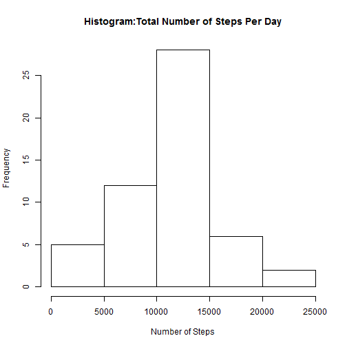
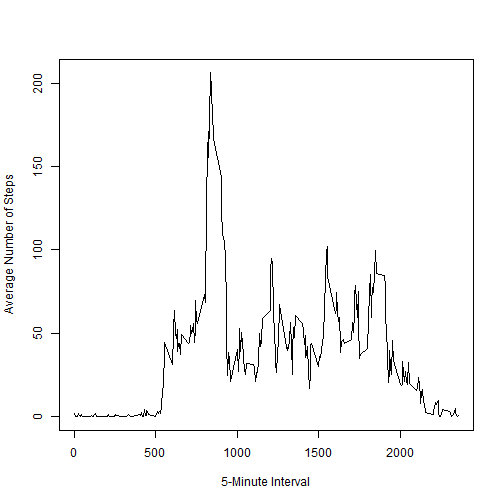
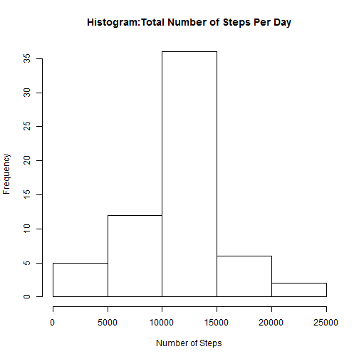
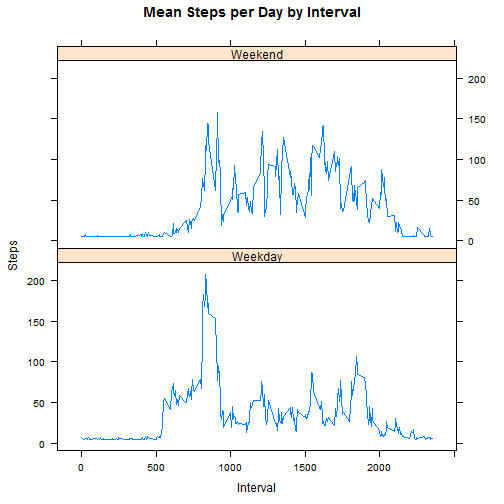

This is an R Markdown document for Projet 1 in the Reproducible Research course. The content below follows the requirements as laid out in the assignment, which are repeated below.

##Loading and preprocessing the data

Set the working directory


```r
setwd("~/Reproducible Research")
```

Load the data


```r
download.file("http://d396qusza40orc.cloudfront.net/repdata%2Fdata%2Factivity.zip",destfile="activity.zip")

unzip("activity.zip")

unlink("activity.zip")

data1 <- read.csv("activity.csv")
```

Change the date field type from Factor to Data


```r
data1$date <- as.Date(data1$date)
```

##What is mean total number of steps taken per day?

Calculate the total number of steps taken per day 


```r
steps_per_day <- aggregate( formula = steps~date, data = data1, FUN = sum )
```

Make a histogram of the total number of steps taken each day


```r
hist(steps_per_day$steps, xlab = "Number of Steps", main = "Histogram:Total Number of Steps Per Day")
```

 

Calculate and report the mean and median of the total number of steps taken per day


```r
round(mean(steps_per_day$steps))
```

```
## [1] 10766
```

```r
round(median(steps_per_day$steps))
```

```
## [1] 10765
```

##What is the Average Daily Activity Pattern

Make a time series plot (i.e. type = "l") of the 5-minute interval (x-axis) and the average number of steps taken, averaged across all days (y-axis)

First, calculate the average number of steps in the 5-minute interval averaged across all days


```r
avg_steps_per_int <- aggregate( formula = steps~interval, data = data1, FUN = mean)
```

Then make the time series plot


```r
plot(avg_steps_per_int$interval,avg_steps_per_int$steps, xlab="5-Minute Interval", ylab="Average Number of Steps", type="l")
```

 

Which 5-minute interval, on average across all the days in the dataset, contains the maximum number of steps?


```r
max_int <- avg_steps_per_int$interval[which(avg_steps_per_int$steps == max(avg_steps_per_int$steps))]
max_int
```

```
## [1] 835
```

##Imputing missing values

Calculate and report the total number of missing values in the dataset (i.e. the total number of rows with NAs)


```r
sum(is.na(data1$steps))
```

```
## [1] 2304
```

Devise a strategy for filling in all of the missing values in the dataset. The strategy does not need to be sophisticated. For example, you could use the mean/median for that day, or the mean for that 5-minute interval, etc.

(Strategy: I will replace missing values with the average value of steps for each interval)

Create a new dataset that is equal to the original dataset but with the missing data filled in.


```r
for (i in 1:length(data1$steps))
  {
  if (is.na(data1$steps[i])) 
    {
    data1$steps[i] = round(mean(avg_steps_per_int$steps))
    }
  }

write.table(data1, 'data1.csv', row.name=FALSE)
```

Calculate the total number of steps taken per day 


```r
steps_per_day2 <- aggregate( formula = steps~date, data = data1, FUN = sum )
```

Make a histogram of the total number of steps taken each day


```r
hist(steps_per_day2$steps, xlab = "Number of Steps", main = "Histogram:Total Number of Steps Per Day")
```

 

Calculate and report the mean and median of the total number of steps taken per day. 


```r
paste("Mean steps with NA=",round(mean(steps_per_day2$steps))," ","Mean steps wit NA replaced=", round(mean(steps_per_day$steps)))
```

```
## [1] "Mean steps with NA= 10752   Mean steps wit NA replaced= 10766"
```

```r
paste("Median steps with NA=",round(median(steps_per_day2$steps))," ","Median steps wit NA replaced=", round(median(steps_per_day$steps)))
```

```
## [1] "Median steps with NA= 10656   Median steps wit NA replaced= 10765"
```
 Do these values differ from the estimates from the first part of the assignment? (Yes) What is the impact of imputing missing data on the estimates of the total daily number of steps? (As can be seen, the mean and medians are slightly higher with the NAs replaced)

##Are there differences in activity patterns between weekdays and weekends?

Create a new factor variable in the dataset with two levels - "weekday" and "weekend" indicating whether a given date is a weekday or weekend day.


```r
for (i in 1:nrow(data1)) {
  if (weekdays(as.Date(data1$date[i])) == "Saturday" | weekdays(as.Date(data1$date[i])) == "Sunday") {
    data1$DoW[i] = "Weekend"
  } else {
    data1$DoW[i] = "Weekday"
  }
}
```

Make a panel plot containing a time series plot (i.e. type = "l") of the 5-minute interval (x-axis) and the average number of steps taken, averaged across all weekday days or weekend days (y-axis). 


```r
steps_per_day3 <- aggregate(steps ~ interval + DoW, data1, mean)

library(lattice)

xyplot(steps_per_day3$steps ~ steps_per_day3$interval|steps_per_day3$DoW, main="Mean Steps per Day by Interval",xlab="Interval", ylab="Steps",layout=c(1,2), type="l")
```

 
